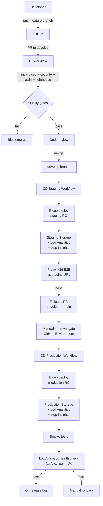

# Personal Webpage — CI/CD Pipeline

> A production-grade CI/CD pipeline for a static personal website, deployed to **Azure Storage (static-website mode)** via **GitHub Actions** with infrastructure defined as code in **Bicep**.

The site itself is intentionally simple — plain HTML/CSS/JS. The interesting part of this repo is the pipeline around it: branching strategy, automated quality gates, environment promotion, infrastructure as code, manual approval gates, and post-deploy verification.

---

## Table of contents

- [Architecture](#architecture)
- [Branching & promotion model](#branching--promotion-model)
- [Pipeline stages](#pipeline-stages)
- [Repository layout](#repository-layout)
- [Local development](#local-development)
- [One-time setup](#one-time-setup)
- [Pipeline reference](#pipeline-reference)
- [Design decisions](#design-decisions)

---

## Architecture



Two long-lived branches (`develop`, `main`) map 1:1 to two Azure environments. A separate Azure resource group, Storage Account, Log Analytics workspace, and Application Insights instance are provisioned per environment.

The site is hosted in **Azure Storage Account static-website mode** — the `$web` blob container serves HTML directly over HTTPS via the Storage account's `*.z<n>.web.core.windows.net` endpoint. Storage diagnostic logs flow into Log Analytics so the post-deploy workflow can query the live error rate.

---

## Branching & promotion model

| Branch | Environment | Trigger | URL |
|---|---|---|---|
| `feature/*` | (CI only — runs all gates) | Open PR to `develop` | — |
| `develop` | Staging | Push / merge to `develop` | `stzrwebstaging.z1.web.core.windows.net` |
| `main` | Production | Merge release PR + manual approval | `stzrwebproduction.z1.web.core.windows.net` |

Branch protection on `develop` and `main`:
- All status checks (lint, bicep, security, a11y, lighthouse) must pass
- At least one approving review
- No direct pushes — PR-only

---

## Pipeline stages

### Continuous Integration ([ci.yml](.github/workflows/ci.yml))

Runs on every PR and push to `develop` / `main`. Five parallel jobs:

| Job | Tool | Purpose |
|---|---|---|
| `lint` | htmlhint, stylelint, eslint | Static analysis of HTML, CSS, JS |
| `bicep` | `az bicep build` | Compile-time validation of all Bicep files |
| `security` | gitleaks, npm audit, Trivy | Secret detection, dependency CVEs, filesystem scan; SARIF uploaded to GitHub Security tab |
| `accessibility` | Pa11y CI (WCAG2AA) | A11y compliance on every page |
| `lighthouse` | Lighthouse CI | Perf ≥ 0.85, A11y ≥ 0.9, BP ≥ 0.9, SEO ≥ 0.9 |

### Continuous Delivery — Staging ([cd-staging.yml](.github/workflows/cd-staging.yml))

Runs on push to `develop`. Sequential jobs:

1. **`infrastructure`** — `az bicep build` → `validate` → `what-if` → `deploy` against the staging subscription via OIDC. Then enables static-website mode on the Storage account (idempotent).
2. **`deploy`** — `az storage blob upload-batch` syncs `src/` to the `$web` container.
3. **`e2e`** — Waits for the live URL to be reachable, then runs the Playwright suite (Chromium + Firefox) against it.
4. **`report`** — Posts a job summary with the live URL.

### Continuous Delivery — Production ([cd-production.yml](.github/workflows/cd-production.yml))

Runs on push to `main`. The first job targets a `production-approval` GitHub Environment configured with **Required reviewers** — this is the manual approval gate. Subsequent jobs:

1. **`approval`** — Pause until a reviewer approves.
2. **`infrastructure`** — Bicep validate / what-if / deploy + enable static website.
3. **`deploy`** — Sync `src/` to production `$web` container.
4. **`smoke`** — Smoke subset of the Playwright suite (`@smoke` tag).
5. **`health`** — KQL query against Log Analytics — fail if 4xx/5xx error rate over the last 5 min exceeds 5%.
6. **`tag`** — Tag the release commit with `release-YYYYMMDD-HHMMSS`.

---

## Repository layout

```
personal_webpage/
├── .github/workflows/
│   ├── ci.yml                  # PR + push checks
│   ├── cd-staging.yml          # develop → staging
│   └── cd-production.yml       # main → production (with approval)
├── infrastructure/
│   ├── main.bicep              # subscription-scoped entrypoint
│   ├── modules/
│   │   └── workload.bicep      # Storage + Log Analytics + App Insights
│   └── parameters/
│       ├── staging.bicepparam
│       └── production.bicepparam
├── tests/
│   ├── e2e/                    # Playwright (Chromium + Firefox)
│   │   ├── playwright.config.js
│   │   ├── smoke.spec.js
│   │   └── navigation.spec.js
│   ├── accessibility/
│   │   └── pa11y-ci.json       # WCAG2AA on every page
│   └── lighthouse/
│       └── lighthouserc.json   # Perf / A11y / BP / SEO budgets
├── src/                        # The actual website
│   ├── index.html
│   ├── index-az.html
│   ├── assets/
│   └── pages/
├── .htmlhintrc
├── .stylelintrc.json
├── eslint.config.js
├── package.json
└── README.md
```

---

## Local development

```bash
# Install all tooling
npm ci

# Serve the site locally on http://localhost:8080
npm run serve

# Run the same checks the CI runs (lint + a11y + lighthouse)
npm run ci

# Individual gates
npm run lint:html
npm run lint:css
npm run lint:js
npm run test:a11y
npm run test:lighthouse
npm run test:e2e
```

---

## One-time setup

### 1. Azure prerequisites

```bash
# Log in with your Azure for Students subscription
az login
az account set --subscription <your-subscription-id>

# Bootstrap each environment by running Bicep manually the first time
# (subsequent updates are driven by the pipeline)
az deployment sub create \
  --location swedencentral \
  --template-file infrastructure/main.bicep \
  --parameters infrastructure/parameters/staging.bicepparam

az deployment sub create \
  --location swedencentral \
  --template-file infrastructure/main.bicep \
  --parameters infrastructure/parameters/production.bicepparam

# Enable static-website mode on each storage account (data-plane, idempotent)
for ENV in staging production; do
  az storage blob service-properties update \
    --account-name "stzrweb${ENV}" \
    --static-website \
    --index-document index.html \
    --404-document index.html \
    --auth-mode login
done
```

### 2. Create a federated credential for GitHub Actions (OIDC, no secrets)

```bash
APP_NAME="github-actions-zrweb"
az ad app create --display-name "$APP_NAME"
APP_ID=$(az ad app list --display-name "$APP_NAME" --query "[0].appId" -o tsv)
az ad sp create --id "$APP_ID"

# Grant Contributor over the subscription (or scope it to RGs for least privilege)
SUB_ID=$(az account show --query id -o tsv)
az role assignment create --role Contributor \
  --assignee "$APP_ID" --scope "/subscriptions/$SUB_ID"

# The pipeline also needs Storage Blob Data Contributor to upload blobs with --auth-mode login
az role assignment create --role "Storage Blob Data Contributor" \
  --assignee "$APP_ID" --scope "/subscriptions/$SUB_ID"

# Federated credentials — one per branch that deploys
for BRANCH in develop main; do
  az ad app federated-credential create --id "$APP_ID" --parameters "{
    \"name\": \"github-$BRANCH\",
    \"issuer\": \"https://token.actions.githubusercontent.com\",
    \"subject\": \"repo:zrustamov/personal_webpage:ref:refs/heads/$BRANCH\",
    \"audiences\": [\"api://AzureADTokenExchange\"]
  }"
done
```

### 3. GitHub repository configuration

**Secrets** (Settings → Secrets and variables → Actions):

| Name | Value |
|---|---|
| `AZURE_CLIENT_ID` | `$APP_ID` from above |
| `AZURE_TENANT_ID` | `az account show --query tenantId -o tsv` |
| `AZURE_SUBSCRIPTION_ID` | Your subscription ID |

That's it. No deployment tokens are needed — auth is via OIDC and storage is via `--auth-mode login`.

**Environments** (Settings → Environments):
- `staging` — no protection
- `production-approval` — **required reviewers** = you (this is the manual gate)
- `production` — restrict to `main` branch

**Branch protection** (Settings → Branches):
- `develop` — require status checks: `lint`, `bicep`, `security`, `accessibility`, `lighthouse`
- `main` — require status checks + 1 approving review + linear history

---

## Pipeline reference

### Quality budgets enforced

| Check | Threshold | Failure mode |
|---|---|---|
| Lighthouse — Performance | ≥ 0.85 | Warning |
| Lighthouse — Accessibility | ≥ 0.9 | **Block** |
| Lighthouse — Best Practices | ≥ 0.9 | Warning |
| Lighthouse — SEO | ≥ 0.9 | Warning |
| Pa11y — WCAG2AA | 0 violations | **Block** |
| Trivy — CVEs | High / Critical | **Block** |
| npm audit | High / Critical | **Block** |
| Production error rate (Log Analytics, 5 min post-deploy) | < 5% | **Block & alert** |

### Adding a new page

1. Create the HTML under `src/pages/`.
2. Add the URL to [tests/lighthouse/lighthouserc.json](tests/lighthouse/lighthouserc.json) and [tests/accessibility/pa11y-ci.json](tests/accessibility/pa11y-ci.json) so the page is part of the quality gates.
3. Add a smoke test in [tests/e2e/smoke.spec.js](tests/e2e/smoke.spec.js) if the page is part of the critical user journey.

---

## Design decisions

**Why Azure Storage static-website mode over Azure Static Web Apps?**
The original design used Azure Static Web Apps — the natural fit for static sites. But the Azure for Students subscription this project is deployed under has a region restriction policy (`sys.regionrestriction`) that whitelists only a small set of European regions (`austriaeast`, `polandcentral`, `spaincentral`, `italynorth`, `swedencentral`). Azure SWA isn't available in any of them — it's only deployed in `westus2`, `centralus`, `eastus2`, `westeurope`, `eastasia`. Storage Accounts are universally available, so the architecture pivots to Storage static-website mode + Log Analytics + Application Insights, all in `swedencentral`.

This is also the pattern Microsoft documents for production static sites in Azure when SWA isn't a fit, so the trade-off is small. The only real loss is per-PR preview environments, which SWA provides natively.

**Why GitHub Actions over Azure DevOps Pipelines?**
The code already lives on GitHub. Keeping CI/CD next to the code reduces context switching and removes the need for a second auth boundary. The `azure/login@v2` action covers everything needed.

**Why Bicep over Terraform?**
Bicep is Azure-native, has zero state file to manage, and `az deployment what-if` gives a high-fidelity diff before applying. Terraform would be the right call in a multi-cloud setup; here it's just an extra tool to learn.

**Why OIDC instead of a service principal secret?**
Federated credentials mean the pipeline holds **no long-lived Azure secret**. The token is minted at run time, scoped to one workflow run, and verifies against GitHub's OIDC issuer. This is the current Microsoft-recommended pattern.

**Why a separate `production-approval` environment?**
GitHub Environments are the only mechanism that pauses a workflow until a human approves. Splitting the approval gate into its own job (depending on a separate environment) keeps the approval explicit and audit-logged, instead of bundling it with the deploy step.

**Why a 5-minute post-deploy health check via Log Analytics?**
Smoke tests confirm that pages load synthetically. They don't catch issues that only show up under real traffic (broken third-party CDN reference, regional DNS issue, etc.). Storage diagnostic settings flow blob-service request logs into Log Analytics, so the workflow queries the live 4xx/5xx rate over the 5 min following deploy and aborts if it spikes.

**Why per-environment resource groups?**
Hard isolation. A misconfigured Bicep change can't accidentally rename or delete a production resource because the staging deployment scopes to a different RG. Cost attribution and access control follow the same boundary.
